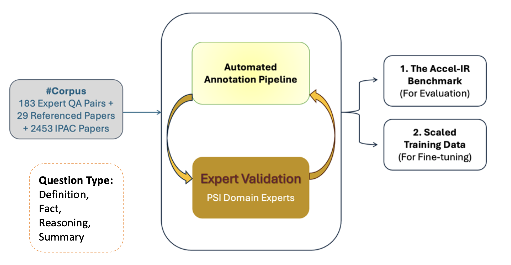

# From Dataset to Optimization: A Benchmarking Framework for Information Retrieval in the Particle Accelerator Domain

This repository publishes a comprehensive benchmarking framework and dataset for information retrieval (IR) in the accelerator physics domain. It includes annotated training and test datasets, tools for LLM-based annotation, model fine-tuning scripts, and an evaluation framework.

## ⚙️ An Expert-Validated Data Generation Framework


## ⚙️ Automated Annotation Pipeline


## 📁 Folder Structure

### `Data/` - Benchmark Datasets

This folder contains the high-quality benchmark datasets for training and testing IR models.

- `Accel_IR_expert_golden_annotation.xlsx`: **`the primary golden dataset`**, the total 390 expert-annotated data entries.
- `Accel_IR_augmented.xlsx`: the total 1357 data entries, including expert-annotated and **`LLM augmented hard negatives`**.

 -   **`Test_data/`**:
    - `IR_test_dataset.xlsx`: for IR evaluation.
    - `Classification_test_dataset.xlsx`: for classification evaluation.
-   **`Training_data/`**: `total_training_data.xlsx`: for fine-tuning models.

---

### `LLM_annotation/` - LLM-Based Annotation Pipeline

Tools for generating training data using Large Language Models (LLMs) with embedding-based retrieval.

-   **`annotate_against_IPAC_top_k.py`**: Annotates IPAC papers by retrieving top-K relevant chunks for the LLM to process.
-   **`annotate_against_expert_paper.py`**: Annotates expert papers by processing all chunks.
-   **`build_vector_store.py`**: Builds FAISS vector stores for fast similarity search.

---

### `finetune/` - Model Fine-Tuning

Scripts to fine-tune embedding models using the annotated training data.

-   **`finetune_model_exc_qwen.py`**: Fine-tunes SentenceTransformer models.
-   **`finetune_qwen_0.6B_emb.py`**: Fine-tunes Qwen embedding models.

**Example usage:**
```bash
python finetune/finetune_model_exc_qwen.py \
    --model-name sentence-transformers/all-mpnet-base-v2 \
    --data-path Data/Training_data/total_training_data.xlsx \
    --output-dir ./fine_tuned_models/mpnet_ft
```

---

### `overall_eval/` - Evaluation Framework

A comprehensive evaluation tool for Information Retrieval tasks.

- **Primary IR evaluation: `overall_eval/IR/cli.py`** 

- Secondary classification evaluation: `overall_eval/Classification/`


Evaluates embedding models and rerankers on the benchmark test dataset.

**Example usage:**
```bash
python overall_eval/IR/cli.py \
    --input Data/Test_data/Filtered_Positive_Questions.xlsx \
    --model sentence-transformers/all-mpnet-base-v2 \
    --kind st \
    --device cuda:0 \
    --output mpnet_base_results
```

**Parameters:**
-   `--input`: Path to the test data Excel file.
-   `--model`: Model name or path.
-   `--kind`: Model type (`st`, `qwen`, `qwen-reranker`).
-   `--device`: CUDA device (e.g., `cuda:0`).
-   `--ks`: k values for evaluation metrics (default: `3,5,10,15,20`).
-   `--output`: Output prefix for result files.

---

### `meta_data_analysis/` - Result Analysis Tools

Scripts for analyzing evaluation results from the IR evaluation.

-   `meta_data_analysis/IR/allowlist/`: Analysis scripts for the allowlist evaluation.
-   `meta_data_analysis/IR/full-corpus/`: Analysis scripts for the full corpus evaluation.

---

## 🚀 Quick Start

### 0. Configure your Gemini API Key

This repo relies on Gemini models for embedding and reasoning model annotation. Please put your API key in code/apikey.env.

Create a `.env` file in the root directory and add your Gemini API key:
```
GENIE_API_KEY=your_gemini_api_key_here
```

### 1. Install Dependencies
```bash
pip install -r requirements.txt
```

### 2. Evaluate a Model
```bash
python overall_eval/IR/cli.py \
    --input Data/Test_data/Filtered_Positive_Questions.xlsx \
    --model BAAI/bge-base-en-v1.5 \
    --kind st \
    --device cuda:0 \
    --output bge_base_results
```

### 3. Fine-tune a Model
```bash
python finetune/finetune_model_exc_qwen.py \
    --model-name sentence-transformers/all-mpnet-base-v2 \
    --data-path Data/Training_data/total_training_data.xlsx \
    --output-dir ./fine_tuned_models/mpnet_ft
```

### 4. Evaluate Fine-tuned Model
```bash
python overall_eval/IR/cli.py \
    --input Data/Test_data/Filtered_Positive_Questions.xlsx \
    --model ./fine_tuned_models/mpnet_ft \
    --kind st \
    --device cuda:0 \
    --output mpnet_ft_results
```

---

## ⚙️ Path Configuration

**Important**: Most scripts contain hardcoded paths that need to be adapted to your environment. Check the scripts in `overall_eval`, `finetune`, and `LLM_annotation` to update paths and API keys.

---

## ⚖️ License

This project is licensed under the MIT License. See the [LICENSE](LICENSE) file for details.

Copyright (c) 2025 Qing Dai University of Zurich, Paul Scherrer Institute, Switzerland

